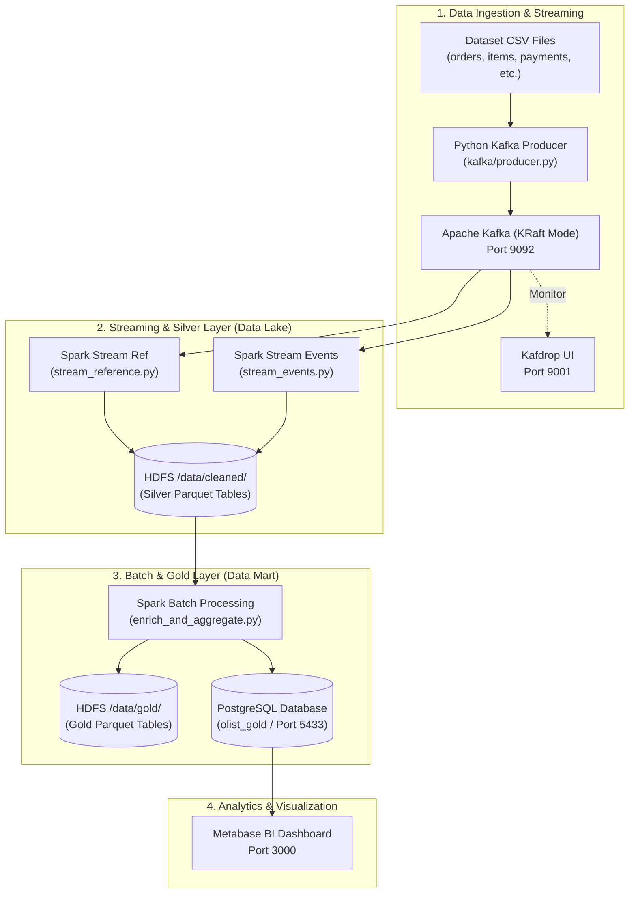

# 🚀 Olistflow — Real-Time & Batch Data Lakehouse Pipeline

**Olistflow** is an end-to-end Data Lakehouse and Analytics platform built to process Brazilian E-Commerce data ([Olist Dataset](https://www.kaggle.com/datasets/olistbr/brazilian-ecommerce)). It demonstrates modern data engineering practices by combining **Real-Time Event Streaming (Apache Kafka)**, **Structured Streaming & Batch Processing (Apache Spark)**, a **Distributed Data Lake (Hadoop HDFS)**, a **Relational Data Mart (PostgreSQL)**, and **Business Intelligence (Metabase)**.

---

## 📐 Architecture & Data Flow



---

## 🛠️ Technology Stack & Services

| Technology               | Role                                                            | Port / Access                          | Container Name                 |
| :----------------------- | :-------------------------------------------------------------- | :------------------------------------- | :----------------------------- |
| **Apache Kafka (7.8.3)** | Real-time event broker running in **KRaft mode** (no ZooKeeper) | `9092`                                 | `kafka`                        |
| **Kafdrop (4.0.2)**      | Web dashboard for monitoring Kafka topics and messages          | `9001`                                 | `kafdrop`                      |
| **Hadoop HDFS (3.2.1)**  | Distributed Storage for Silver & Gold Data Lake layers          | `9870` (UI), `9000` (RPC)              | `namenode`, `datanode`         |
| **Apache Spark (3.5.1)** | Stream & Batch Data Processing Engine                           | `8080` (Master UI), `8081` (Worker UI) | `spark-master`, `spark-worker` |
| **PostgreSQL (16)**      | Relational Data Mart storing final aggregated KPI tables        | `5433` (`5432` internal)               | `postgres`                     |
| **Metabase (0.49.13)**   | Business Intelligence & Data Visualization dashboard            | `3000`                                 | `metabase`                     |

---

## 📁 Repository Structure

```text
Olistflow/
├── dataset/                    # Source CSV raw dataset files
│   ├── customers.csv
│   ├── order_items.csv
│   ├── order_payments.csv
│   ├── orders.csv
│   ├── products.csv
│   └── sellers.csv
├── kafka/                      # Kafka producers & topic setup scripts
│   ├── producer.py             # Custom streaming & batch producer script
│   └── topics-creation.txt     # CLI commands to create Kafka topics
├── spark/                      # PySpark streaming & batch ETL scripts
│   ├── stream_reference.py     # Silver ETL: Streams reference tables to HDFS
│   ├── stream_events.py        # Silver ETL: Streams event tables with watermarks to HDFS
│   ├── enrich_and_aggregate.py # Gold ETL: Batch joins, KPI aggregation & DB writes
│   └── files_run_commands.txt  # Execution commands for spark-submit
├── spark-conf/                 # Custom Spark configurations
│   └── spark-defaults.conf     # Spark extra classpath for JARs
├── spark-jars/                 # Required dependencies (Kafka connector, Postgres JDBC, etc.)
├── docker-compose.yml          # Infrastructure orchestration configuration
├── hadoop.env                  # Environment variables for Hadoop HDFS
├── Olist KPIs Dashboard.pdf    # Business requirement KPI specifications
└── README.md                   # Project documentation
```

---

## 🏗️ Stage-by-Stage Design Decisions & Rationale

### 1. Ingestion Stage: Apache Kafka & Custom Producer

- **Choice**: Confluent Kafka in **KRaft Mode** (ZooKeeper-less architecture).
  - _Why_: Simplifies cluster management, reduces container resource overhead, and aligns with modern Kafka production standards.
- **Choice**: Dual Ingestion Modes in [`kafka/producer.py`](file:///d:/NTI/Olistflow/kafka/producer.py).
  - _Real-Time Event Replay_: `orders.csv` is sorted chronologically by `order_purchase_timestamp` and streamed with scaled time delays (`SCALE_FACTOR = 86400 * 10`) to simulate real production order traffic.
  - _Batch Replay_: Dimension and detail tables (`customers`, `products`, `sellers`, `order_items`, `order_payments`) are published in fast batches.
- **Choice**: Keyed Partitioning.
  - _Why_: Partitioning event topics (`orders`, `order_items`, `order_payments`) using `order_id` as the message key guarantees message ordering per order across 3 partitions.

---

### 2. Silver Layer: Spark Structured Streaming to HDFS Data Lake

- **Choice**: PySpark Structured Streaming ([`stream_reference.py`](file:///d:/NTI/Olistflow/spark/stream_reference.py) & [`stream_events.py`](file:///d:/NTI/Olistflow/spark/stream_events.py)).
  - _Why_: Continuously consumes data from Kafka, applies strict schema validation, parses raw JSON, casts datatypes, and drops records with missing required primary keys.
- **Choice**: Event-Time Watermarking (`withWatermark("order_purchase_timestamp", "1 hour")`).
  - _Why_: Handles late-arriving event data safely and prevents unbounded state growth in streaming memory.
- **Choice**: Parquet Format with HDFS Checkpointing (`outputMode("append")`).
  - _Why_: Parquet provides columnar compression (Snappy), fast read performance, and schema enforcement. HDFS checkpointing ensures **fault tolerance and exactly-once processing**.

---

### 3. Gold Layer: Spark Batch Aggregations & Dual-Target Storage

- **Choice**: PySpark Batch ETL ([`enrich_and_aggregate.py`](file:///d:/NTI/Olistflow/spark/enrich_and_aggregate.py)).
  - _Why_: Reads cleaned Silver Parquet data from HDFS, filters out canceled orders, and computes high-level business metrics.
- **Choice**: Broadcast Joins (`broadcast(tables["customers"])`, `broadcast(tables["products"])`).
  - _Why_: Small lookup tables are broadcasted to all Spark executors, eliminating costly network shuffle operations during large join steps.
- **Choice**: Dual Storage Strategy (HDFS Parquet + PostgreSQL JDBC).
  - _Why_: Saves raw Parquet datasets to HDFS (`/data/gold/`) for archival and ad-hoc data science queries, while simultaneously writing to PostgreSQL (`olist_gold`) via JDBC for fast index-backed SQL queries in Metabase.

---

### 4. Serving & BI Stage: PostgreSQL & Metabase

- **Choice**: PostgreSQL + Metabase.
  - _Why_: Metabase directly connects to PostgreSQL to deliver fast interactive dashboards without stressing the HDFS cluster.

---

## 📊 Business KPIs Computed in Gold Layer

1. **`kpi_revenue_by_state_category`**: Analyzes sales performance across customer states and product categories.
   - _Metrics_: Total items sold, total orders, item revenue, freight value, gross revenue.
2. **`kpi_delivery_sla_by_state`**: Evaluates logistics performance and fulfillment speed per state.
   - _Metrics_: Average actual delivery days, average estimated delivery days, delay days, delayed order count, delay rate percentage, and on-time SLA percentage.
3. **`kpi_payment_type_breakdown`**: Tracks customer payment habits by state and payment method.
   - _Metrics_: Transaction count, total payment value, average transaction value, and average installments.

---

## 🚦 How to Run the Pipeline

### Prerequisites

- [Docker Desktop](https://www.docker.com/products/docker-desktop/) installed and running.
- Python 3.9+ installed locally (for running the producer script).
- `confluent-kafka` Python package installed:
  ```bash
  pip install confluent-kafka
  ```

---

### Step 1: Start the Infrastructure

Spin up all 7 Docker containers in detached mode:

```bash
docker-compose up -d
```

Verify that all containers are healthy:

```bash
docker-compose ps
```

---

### Step 2: Create Kafka Topics

Execute the topic creation commands inside the `kafka` container:

```bash
docker exec -it kafka bash -c "
kafka-topics --create --bootstrap-server localhost:9092 --topic orders --partitions 3 --replication-factor 1
kafka-topics --create --bootstrap-server localhost:9092 --topic order_items --partitions 3 --replication-factor 1
kafka-topics --create --bootstrap-server localhost:9092 --topic order_payments --partitions 3 --replication-factor 1
kafka-topics --create --bootstrap-server localhost:9092 --topic customers --partitions 3 --replication-factor 1
kafka-topics --create --bootstrap-server localhost:9092 --topic products --partitions 1 --replication-factor 1
kafka-topics --create --bootstrap-server localhost:9092 --topic sellers --partitions 1 --replication-factor 1
"
```
### Step 3: Run the Kafka Data Producer

Execute the Python producer script from your local host machine to populate Kafka topics:

```bash
python kafka/producer.py
```

> You can open [http://localhost:9001](http://localhost:9001) (Kafdrop) to watch topics receive messages in real time!

---

### Step 4: Launch Spark Streaming Jobs (Silver Layer)

Run the streaming jobs inside `spark-master` to start ingesting from Kafka into HDFS Silver Parquet:

1. **Start Reference Stream**:
   ```bash
   docker exec -d spark-master /opt/spark/bin/spark-submit --master spark://spark-master:7077 /opt/spark-apps/spark/stream_reference.py
   ```
2. **Start Events Stream**:
   ```bash
   docker exec -d spark-master /opt/spark/bin/spark-submit --master spark://spark-master:7077 /opt/spark-apps/spark/stream_events.py
   ```

---

### Step 5: Run Gold Layer Aggregation & Database Ingestion

Once data has streamed into HDFS Silver layer, execute the batch aggregation script:

```bash
docker exec -it spark-master /opt/spark/bin/spark-submit --master spark://spark-master:7077 /opt/spark-apps/spark/enrich_and_aggregate.py
```

This writes the computed KPIs to HDFS (`hdfs://namenode:9000/data/gold/`) and PostgreSQL database `olist_gold`.

---

### Step 6: Access Dashboard & Management Interfaces

| Web Interface           | URL                                            | Credentials / Notes                                                                                                           |
| :---------------------- | :--------------------------------------------- | :---------------------------------------------------------------------------------------------------------------------------- |
| **Kafdrop (Kafka UI)**  | [http://localhost:9001](http://localhost:9001) | No login required                                                                                                             |
| **Hadoop NameNode UI**  | [http://localhost:9870](http://localhost:9870) | Browse HDFS files at `/data/cleaned` and `/data/gold`                                                                         |
| **Spark Master UI**     | [http://localhost:8080](http://localhost:8080) | Monitor active applications and cluster workers                                                                               |
| **Spark Worker UI**     | [http://localhost:8081](http://localhost:8081) | Monitor worker thread execution                                                                                               |
| **Metabase BI UI**      | [http://localhost:3000](http://localhost:3000) | Initial setup wizard; Connect to Host: `postgres`, Port: `5432`, DB: `olist_gold`, User: `postgres`, Pass: `postgrespassword` |
| **PostgreSQL Database** | `localhost:5433`                               | Database: `olist_gold`, User: `postgres`, Password: `postgrespassword`                                                        |

---

## ⚙️ Environment Constraints & Configuration Notes

- **Hadoop HDFS Setup**:
  - Set to single-node replication (`dfs.replication=1`).
  - WebHDFS enabled and permission checks disabled (`dfs.permissions.enabled=false`) via [`hadoop.env`](file:///d:/NTI/Olistflow/hadoop.env) to grant Spark write permissions as root.
- **Spark Classpath Configuration**:
  - Dependencies pre-loaded in [`spark-jars/`](file:///d:/NTI/Olistflow/spark-jars/) and configured via [`spark-conf/spark-defaults.conf`](file:///d:/NTI/Olistflow/spark-conf/spark-defaults.conf) to automatically supply PostgreSQL JDBC drivers (`postgresql-42.7.4.jar`) and Kafka connectors (`spark-sql-kafka-0-10_2.12-3.5.1.jar`).
- **PostgreSQL Port Forwarding**:
  - Mapped to external host port `5433` to prevent conflicts with local PostgreSQL instances, while remaining accessible internally to container networks on port `5432`.
